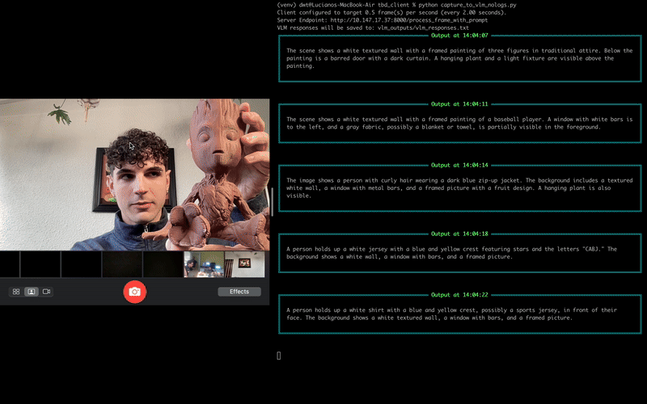

# Real Time Video Analysis and Summarization System

This project provides a comprehensive system for analyzing real-time videos using Vision Language Models (VLM) and generating summaries of the content. The system works in two main phases: real-time frame analysis and post-processing summarization.

The server component uses Ollama to run the VLM and LLM models, providing real-time analysis and summarization capabilities.

## Features

- Real-time video frame analysis using Vision Language Models
- Frame-by-frame descriptions with timestamps
- Multi-modal summarization combining visual and audio transcription content
- Text-only chat capabilities
- Rich console output formatting
- Configurable system prompts for different use cases

## Components

### 1. Server (`server.py`)
- Runs FastAPI server to handle client requests
- Manages Ollama VLM and LLM models
- Processes video frames and generates descriptions
- Handles text-based chat interactions
- Provides API endpoints for all client operations

### 2. Real-time Frame Analysis (`client.py`)
- Captures video frames from webcam in real-time
- Sends frames to server for VLM analysis
- Receives and displays frame descriptions
- Saves timestamped descriptions to a file

### 3. Video Summary Generation (`summarize_video.py`)
- Processes the saved frame descriptions
- Generates chronological summaries of video content
- Creates concise narrative summaries of visual events

### 4. Audio-Video Summary Generation (`summarize_video_audio.py`)
- Combines saved frame descriptions with audio transcription
- Provides comprehensive summaries integrating both visual and audio content

### 5. Text Chat (`prompt_only.py`)
- Enables text-only interactions with the LLM
- Supports system prompts for different roles and contexts
- Example use cases included

## Setup and Configuration

1. Install required packages for both server and client:
   ```bash
   pip install -r requirements.txt
   ```

2. Configure server settings:
   - Update `UBUNTU_SERVER_IP` and `UBUNTU_SERVER_PORT` in the configuration section of each script

3. Prepare input stream and files:
   - Ensure your web camera is accessible and properly configured
   - For audio analysis, prepare audio transcription files

4. Start the server:
   ```bash
   # Run the FastAPI server with uvicorn
   uvicorn server.server:app --host 0.0.0.0 --port 8000 --workers 1
   ```

<!-- ## Demo

### Real-time VLM Analysis

*Real-time video frame analysis showing VLM descriptions of each scene*

### Summarization Process

*Example of how the system processes and summarizes video content* -->
